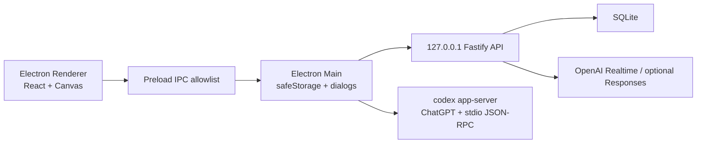

# Architecture

The desktop app is split into strict process and package boundaries.

## Runtime Roles

- Electron main owns OS integration, secure storage, local server startup, file dialogs, and Codex App Server process management.
- Preload exposes a small allowlist to the renderer. The renderer does not receive Node.js access.
- The local server binds to `127.0.0.1` only and brokers lower-level OpenAI calls when explicitly enabled.
- The renderer owns the Live2D stage, chat UI, voice controls, and developer panel presentation.
- Codex App Server is the primary text chat bridge. It uses the local Codex/ChatGPT login and streams assistant deltas back to the renderer.

## Conversation Modes

- Text mode sends input to Electron main IPC, which calls `codex app-server` with `thread/start` and `turn/start`.
- Voice mode is scaffolded through `/session` for Realtime WebRTC SDP exchange. The renderer owns microphone and audio playback.
- Character presentation is represented by `CharacterDirective` so expression, motion, and speaking style can evolve independently from raw model text.
